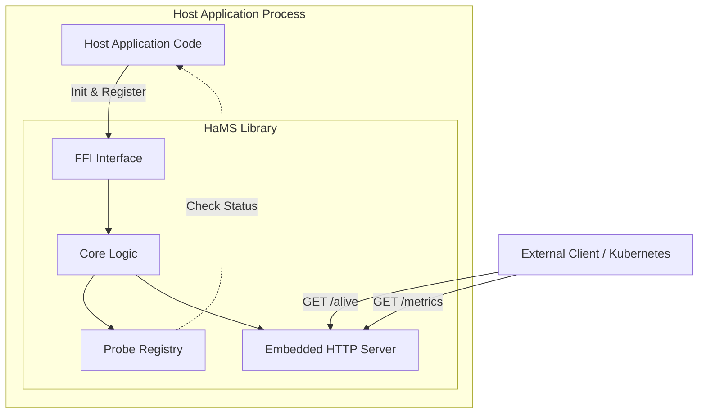
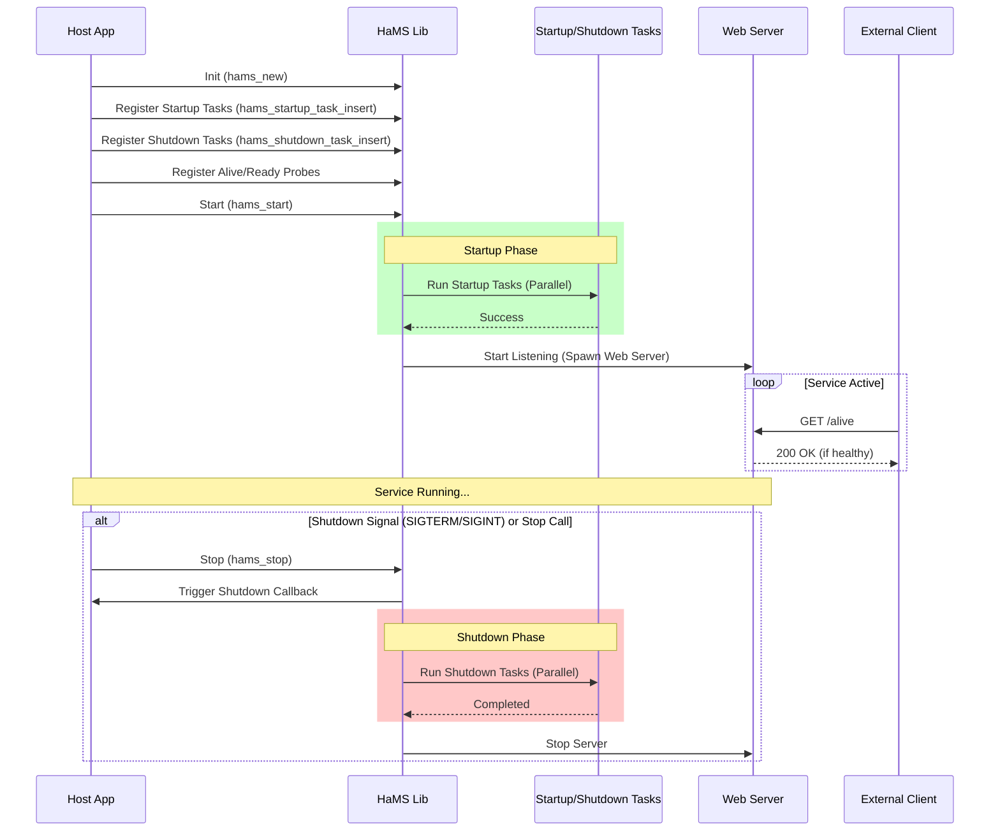

# HaMS: Health and Monitoring System

[](https://github.com/PolecatWorks/hams/actions/workflows/rust.yml)

HaMS is a health and monitoring library written in Rust. It is designed to implement Kubernetes lifecycle interfaces (Liveness/Readiness probes) and expose metrics.

It is built as a shared object (`libhams.dylib` / `libhams.so`) so it can be utilized by multiple languages (C/C++, Python, Node.js, Java/Kotlin) via FFI.

## Project Structure

## Project Structure



## Lifecycle Sequence



This repository consists of several key components:

-   **`hams`**: The core library. It implements the health checks (alive/ready), web server, and FFI interface.
-   **`hamsrs`**: A safe Rust wrapper around the `hams` FFI. Use this if you are integrating HaMS into a Rust application.
-   **`ffi-log2`**: A utility library that enables the shared object to log via the host application's logger, ensuring unified logging.
-   **`sample-rust`**: An example Rust application demonstrating how to use `hamsrs` and `ffi-log2`.

## Usage (Rust)

To run the Rust sample application, which demonstrates a fully integrated HaMS service:

```bash
cargo watch -x "run -- --config sample-rust/test_data/config.yaml start"
```

This starts the service with a configuration file that sets the web server prefix to `api`.

## API Reference

The HaMS web server exposes a lightweight HTTP server to provide health checks, readiness probes, version information, and metrics.

**Default Port**: `8080` (Configurable via `HamsConfig`)

### Health & Readiness

#### `GET /hams/alive`
**Description**: Liveness probe. Checks if the service is running and all "alive" checks are passing.
**Responses**:
- `200 OK`: Service is healthy.
- `503 Service Unavailable`: Service is unhealthy (one or more probes failed).

**Response Body (JSON)**:
```json
{
  "name": "HamName",
  "valid": true
}
```

#### `GET /hams/ready`
**Description**: Readiness probe. Checks if the service is ready to accept traffic and all "ready" checks are passing.
**Responses**:
- `200 OK`: Service is ready.
- `503 Service Unavailable`: Service is not ready.

**Response Body (JSON)**:
```json
{
  "name": "HamName",
  "valid": true
}
```

#### `GET /hams/alive_verbose` / `GET /hams/ready_verbose`
**Description**: Detailed version of the probes, listing the status of each individual check.
**Responses**: `200` or `503`.

**Response Body (JSON)**:
```json
{
  "name": "HamName",
  "valid": true,
  "details": [
    { "name": "database_connection", "valid": true },
    { "name": "cache_warmup", "valid": false }
  ]
}
```

### Lifecycle

#### `GET /hams/version`
**Description**: Returns version information for the service and the HaMS library itself.
**Responses**:
- `200 OK`

**Response Body (JSON)**:
```json
{
  "name": "Service Name",
  "version": "1.0.0",
  "hams_name": "HaMS",
  "hams_version": "0.1.0"
}
```

#### `POST /hams/shutdown`
**Description**: Triggers the registered shutdown callback in the host application. Used for graceful shutdown requests.
**Responses**:
- `200 OK`: Shutdown signal received.
- `500 Internal Server Error`: Failed to trigger shutdown.

### Metrics

#### `GET /hams/metrics`
**Description**: Exposes metrics in Prometheus text format (or any format supported by the registered callback).
**Responses**:
- `200 OK`: Metrics retrieved successfully.
- `500 Internal Server Error`: Accessing metrics failed (e.g., locking issue, callback implementation error).

**Response Format**: `text/plain`

## Error Handling

The API returns appropriate HTTP status codes for various failure conditions:

| Status Code | Reason | Description |
| :--- | :--- | :--- |
| `409 Conflict` | Already Running | The service or a component is already active. |
| `503 Service Unavailable` | Cancelled | The operation was cancelled. |
| `406 Not Acceptable` | Probe Not Good | The requested probe name is invalid. |
| `500 Internal Server Error` | Callback Error | The external callback (FFI) failed. |
| `500 Internal Server Error` | Join Error | Failed to join an internal thread. |
| `500 Internal Server Error` | FFI Error | A low-level FFI error occurred (e.g., null pointer, buffer size). |

## Integration Details

### `hamsrs` (Rust Integration)

`hamsrs` provides a high-level, safe Rust API.

```rust
use hamsrs::{Hams, ProbeManual};
use hamsrs::hams::config::HamsConfig;

// Initialize logging (bridges hams internal logs to your app's logger)
hamsrs::hams_logger_init(ffi_log2::log_param()).unwrap();

// Create probes
let manual_probe = ProbeManual::new("manual_check", true).unwrap();

// Create and start HaMS
let config = HamsConfig::default();
let hams = Hams::new(cancellation_token, &config).unwrap();


// Register probes
hams.alive_insert(manual_probe.clone()).expect("Failed to insert probe");

// Register Startup/Shutdown Tasks
hams.startup_task_insert(
    manual_probe.clone(),
    3,    // retries
    100,  // sleep_ms between retries
    5000, // timeout_ms
).expect("Failed to insert startup task");

hams.shutdown_task_insert(
    manual_probe.clone(),
    3,
    100,
    1000,
).expect("Failed to insert shutdown task");

hams.start().unwrap();
```

### Manual Build / C-API Usage

If you are building the shared object directly for use in C/C++ or other languages without using Cargo's linking, you may need to adjust the `rpath` on macOS to ensure the library can be found relative to your binary.

**macOS `rpath` Adjustment:**

```bash
# Update the ID to include an rpath
install_name_tool -id @rpath/../lib/libhams.dylib target/debug/libhams.dylib

# Verification
otool -L target/debug/libhams.dylib
```

**Check Link Dependencies:**

```bash
otool -L <binary>
```

## Testing with Miri

To run tests with Miri (Undefined Behavior detector):

```bash
cargo watch -x 'miri test'
```

## Useful References

*   [Rust FFI Patterns](https://rust-unofficial.github.io/patterns/intro.html)
*   [Understanding RPATH](https://itwenty.me/posts/01-understanding-rpath/)
*   [Wrapping Unsafe C Libraries in Rust](https://medium.com/dwelo-r-d/wrapping-unsafe-c-libraries-in-rust-d75aeb283c65)
